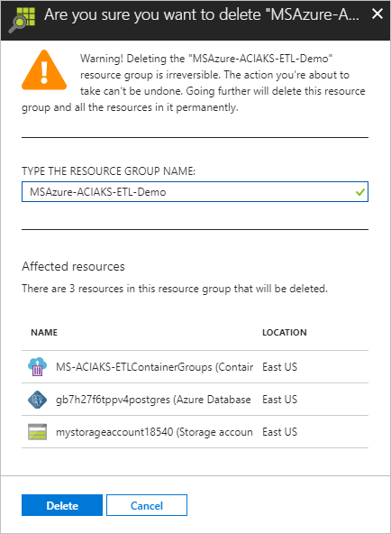
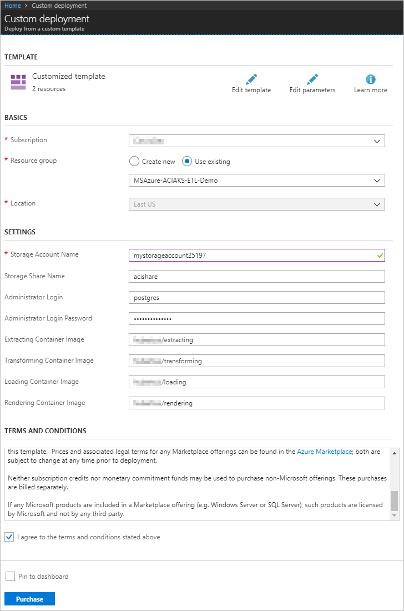
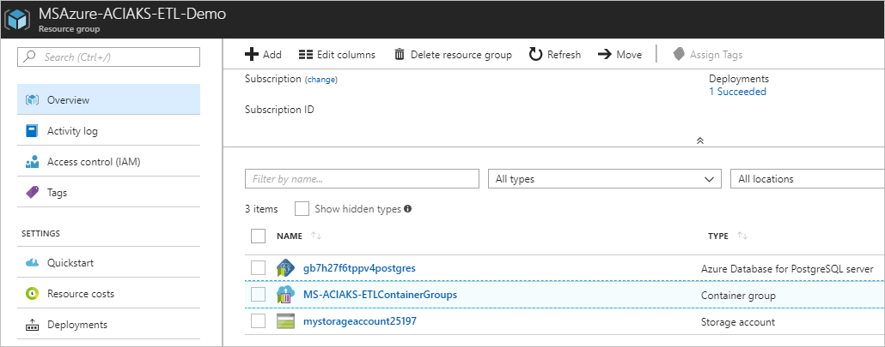
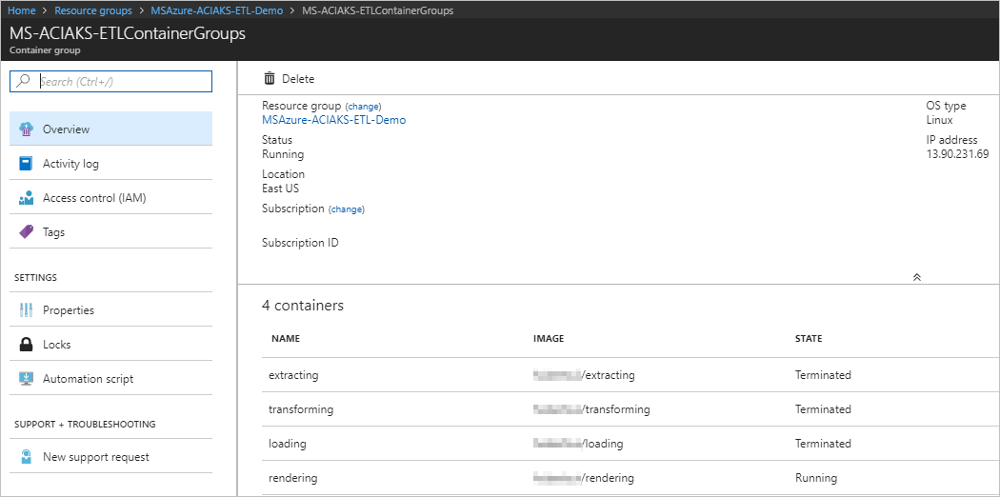
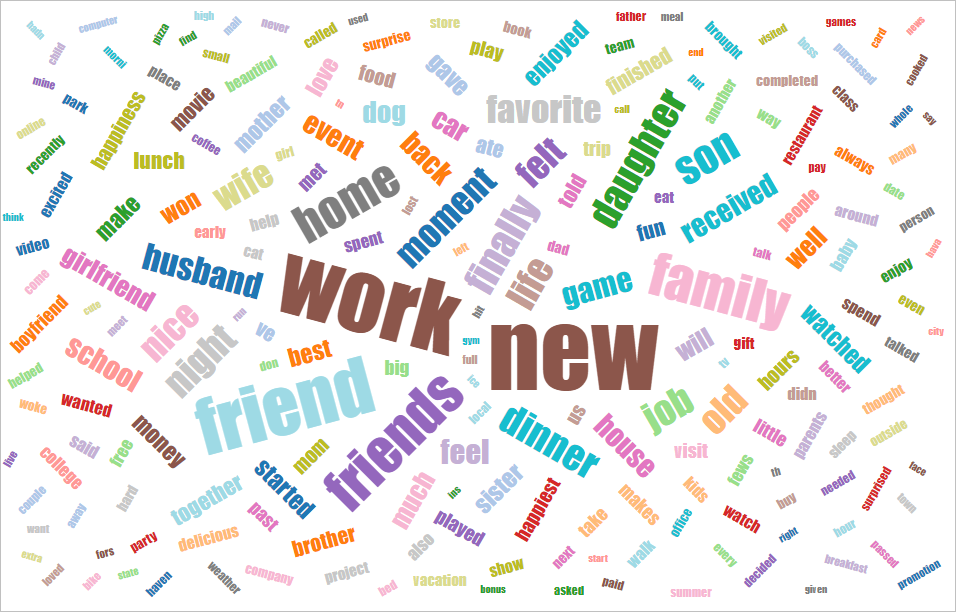
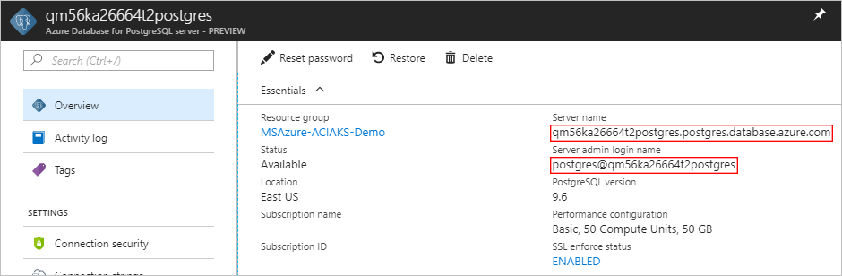
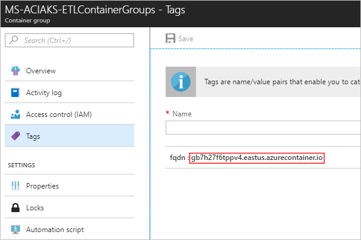

# Extracting, transforming, and loading data with ACI

In this sample, we're trying to do some basic analysis on the [HappyDB](https://github.com/rit-public/HappyDB) dataset, by doing word count and drawing word cloud, to highlight the words appear more frequently in the people's happy moments.

**Table of content**

[Foreword](#foreword)

[Build Docker Images](#build-docker-images)

[Create Azure Storage Account and File Share](#create-azure-storage-account-and-file-share)

[Deploy Azure Components](#deploy-azure-components)

[Check the Demo](#check-the-demo)

* [View Demo in Web](#view-demo-in-web)

* [Create Index and Query Data in Azure Shell](#create-index-and-query-data-in-azure-shell)

[References](#references)

## Foreword

Making ETLing simpler using containers as a plug and play model.

The application with separate common pieces of the ETLing process into separate docker containers. For example, the unzip container in the project will take a link as an input then download and unzip the file at that link. A separate container takes a csv location as an input and puts it into a Postgres database. This allows for plug and play ETLing pipelines for the data.

Using ACI, a user can define container groups with the exact elements they want. For example put the unzip and postgres modules together and to download a zip file from a datasource, unzip it then feed it into a databases all without writing a line of code. This allows you to only pay per second using the ACI instance. 

This document will guide you through the steps to deploy the solution to your environment.

An Azure Active Directory (AAD) is required to register the app registrations. In this document, the AAD will be called "ETL AAD", and an account in the ETL AAD will be called ETL work account.

* All app registrations are created in the ETL AAD. 

An Azure Subscription is required to deploy the Azure components. The [ARM Template](azuredeploy.json) deploys these Azure components automatically. 

## Build Docker Images

   > **Note:** The following commands are running on your own computer.

1. Clone the repository with Visual Studio Code.

2. Open **View > Integrated Terminal**.

3. Execute the commands below to build and push the extracting image to the Docker Hub.

   ```powershell
   cd cmd/extracting
   docker build -t YOURDOCKERACCOUNTNAME/extracting .
   docker push YOURDOCKERACCOUNTNAME/extracting
   ```

4. Execute the commands below to build and push the transforming image to the Docker Hub.

   ```powershell
   cd ../extracting
   docker build -t YOURDOCKERACCOUNTNAME/transforming .
   docker push YOURDOCKERACCOUNTNAME/transforming
   ```

5. Execute the commands below to build and push the loading image to the Docker Hub.

   ```powershell
   cd ../extracting
   docker build -t YOURDOCKERACCOUNTNAME/loading .
   docker push YOURDOCKERACCOUNTNAME/loading
   ```

6. Execute the commands below to build and push the rendering image to the Docker Hub.

   ```powershell
   cd ../extracting
   docker build -t YOURDOCKERACCOUNTNAME/rendering .
   docker push YOURDOCKERACCOUNTNAME/rendering
   ```

## Create Azure Storage Account and File Share

> **Note:** The following commands are running on Azure Portal.

1. Open the **Shell** in the Azure Portal.

   

2. Execute the command below to choose your subscription.

   ```powershell
   az account set --subscription SELECTED_SUBSCRIPTION_ID
   ```

3. Execute the commands below to create a new resource group.

   > **Note:** Change the placeholder `[RESOURCE_GROUP_NAME]` to the name for the new resource group you will create.
   
   ```powershell
   ACI_PERS_RESOURCE_GROUP=[RESOURCE_GROUP_NAME]
   ACI_PERS_STORAGE_ACCOUNT_NAME=mystorageaccount$RANDOM
   ACI_PERS_LOCATION=eastus
   ACI_PERS_SHARE_NAME=acishare
   az group create --location eastus --name $ACI_PERS_RESOURCE_GROUP
   ```

4. Execute the commands below to create the storage account.

   ```powershell
   az storage account create \
    --resource-group $ACI_PERS_RESOURCE_GROUP \
    --name $ACI_PERS_STORAGE_ACCOUNT_NAME \
    --location $ACI_PERS_LOCATION \
    --sku Standard_LRS
   ```

5. Execute the commands below to create the file share.

   ```powershell
   export AZURE_STORAGE_CONNECTION_STRING=`az storage account show-connection-string --resource-group $ACI_PERS_RESOURCE_GROUP --name $ACI_PERS_STORAGE_ACCOUNT_NAME --output tsv`
   az storage share create -n $ACI_PERS_SHARE_NAME
   ```

6. Execute the commands below to shows the storage account you created.

   ```powershell
   echo $ACI_PERS_STORAGE_ACCOUNT_NAME
   ```
   

## Deploy Azure Components

1. Click this button to navigate to the Azure Portal deployment page.

   [](https://portal.azure.com/#create/Microsoft.Template/uri/https%3A%2F%2Fraw.githubusercontent.com%2Fhubertsui%2Fbetter-etling%2Fmaster%2Fazuredeploy.json)

2. Choose the resource group created in the previous steps.

3. Fill in the values on the deployment page.
   * **Storage Account Name**: the name of the storage account created in the previous steps
   * **Storage Share Name**: the name of the file share created in the previous steps, which is `acishare` by default
   * **Administrator Login**:  the user name of the Postgres database
   * **Administrator Login Password**: the password of the Postgres database, it must meet the complexity requirements, e.g. `postgres1!`
   * **Extracting Container Image**: the Docker image you built for the extracting container
   * **Transforming Container Image**: the docker image you built for the transforming container
   * **Loading Container Image**: the docker image you built for the loading container
   * **Rendering Container Image**: the docker image you built for the rendering container
   * Check **I agree to the terms and conditions stated above**.

   

4. Click **Purchase**

## Check the Demo

### View Demo in Web

1. Open the resource group you just created.

   

2. Click the container group **MS-ACIAKS-ETLContainerGroups**, notice the state of the first 3 containers is **Terminated**, while the last one is always **Running** to serve the Word Cloud.

   

3. Copy the **IP address** from the container group blade, and open it in the browser to check the Word Cloud.

   

### Create Index and Query Data in Azure Shell

> **Note:** The following commands are running on Azure Portal.

1. Open the resource group you just created.

   

2. Click the **postgres** database, remember the **Server name** and **Server admin login name**.

   

3. Open the **Shell** in the Azure Portal.

   

4. Add the updated Azure Database for PostgreSQL management extension using the following command.

   ```powershell
   az extension add --name rdbms
   ```

5. Run the following psql command then input the **Administrator Login Password** in deployment to connect to an Azure Database for PostgreSQL database.
    > **Note:** Please replace the **&lt;Server name&gt;** and **&lt;Server admin login name&gt;** to values in postgres dashboard.

   ```powershell
   psql --host=<Server name> --username=<Server admin login name> --dbname=postgres
   ```
   
6. Run the following SQL command to create an index to table **words**

    ```SQL
    CREATE INDEX ON words(name);
    ```
6. Run the following SQL command to query first 10 records in **words**

    ```SQL
    SELECT * FROM words LIMIT 10;
    ```

8. Now you can see the word count data like this.

   


## References
1. Akari Asai, Sara Evensen, Behzad Golshan, Alon Halevy, Vivian Li, Andrei Lopatenko, Daniela Stepanov, Yoshihiko Suhara, Wang-Chiew Tan, Yinzhan Xu, 
``HappyDB: A Corpus of 100,000 Crowdsourced Happy Moments'', LREC '18, May 2018. (to appear)
